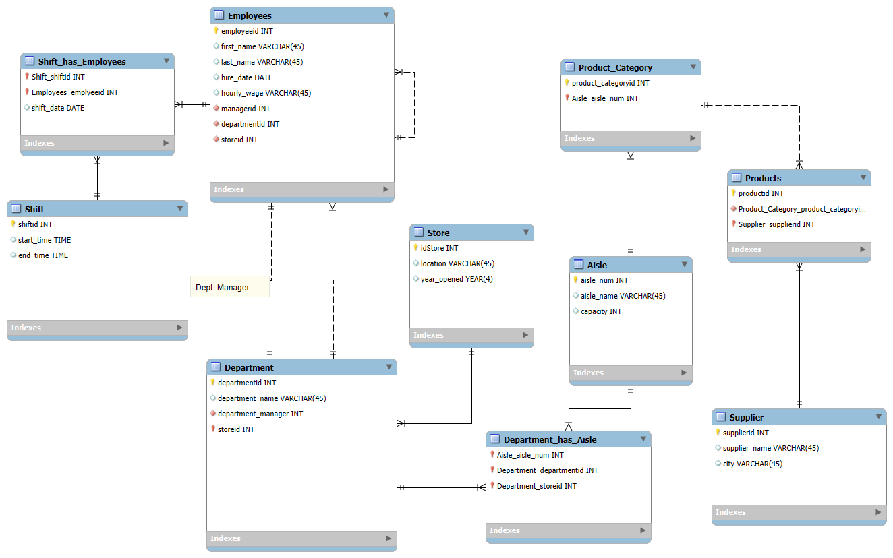

# Retail Store Management Database

**Team Members:**  
Joanne Lee, Arian Mazloom, Bryson Tanner, Jack Cramer, Richard Kimmig  

---

## 📘 Scenario Description

The data model we created is designed to maintain comprehensive records essential for keeping our retail store operations efficient and organized. It contains all information regarding **suppliers, products, departments, aisles, stores, employees, and work shifts**.

To begin with, the supplier data allows us to track each supplier’s **location and name**, ensuring products arrive on time and in excellent condition. Once the products are received, they are organized by **aisle and department**, giving customers an easy and accessible shopping experience.

Each store is composed of multiple departments, which creates an environment that allows shoppers to find various products without visiting multiple locations. Finally, the model includes detailed employee information such as **hire dates, managers, shifts, and wages**, which helps maintain clean employment records and a clear chain of command.

This database provides the foundation for operational efficiency, workforce management, and data-driven decision-making across our business.

---

## 🧩 Data Model
  


**Data Model**

The data model represents the structure and relationships of a grocery store database. It organizes how the store tracks its departments, employees, products, suppliers, and daily operations like shifts and aisles.

At its core, the Store entity connects to multiple Departments, each overseeing a specific category of goods (e.g., Dairy, Produce, Bakery).
Each Department employs multiple Employees, with one serving as the Department Manager. Employees work various Shifts, which are tracked in a many-to-many relationship via the Shift_has_Employees table.

Aisles represent physical areas in the store where products are displayed. Departments are linked to aisles through the Department_has_Aisle table, showing which departments are responsible for which sections.

Suppliers provide products to the store. Each supplier delivers goods that fall under different Product Categories, which are located in specific aisles.
The Products table ties this information together, linking each item to its supplier and product category.

Relationships

- Store → Department: One store has many departments (1:N)
- Department → Employee: One department has many employees (1:N)
- Employee → Shift: Many employees can work many shifts (M:N via Shift_has_Employees)
- Department → Aisle: Many departments can be responsible for many aisles (M:N via Department_has_Aisle)
- Aisle → Product_Category: Each aisle can contain multiple product categories (1:N)
- Product_Category → Product: Each category contains many products (1:N)
- Supplier → Product: Each supplier provides many products (1:N)

**Data Supported**

The database supports storage of:
  - Store locations and departments
  - Employee details, roles, and work schedules
  - Department–aisle assignments
  - Product information (name, category, supplier)
  - Supplier details and sourcing information

**Data Not Supported**

The database does not store:
  - Customer or sales transaction data
  - Real-time inventory counts or restock tracking
  - Product pricing, promotions, or discounts
  - Customer loyalty or membership information
  - Financial or accounting data

---

## 📗 Data Dictionary

| Table Name | Key Fields | Description |
|-------------|-------------|--------------|
| **Store** | `idStore`, `location`, `year_opened` | Contains store-level data. |
| **Aisle** | `aisle_num`, `aisle_name`, `capacity` | Defines aisles and their capacity. |
| **Department** | `departmentid`, `department_name`, `storeid` | Organizes store departments. |
| **Employees** | `employeeid`, `first_name`, `last_name`, `hire_date`, `hourly_wage`, `managerid`, `departmentid`, `storeid` | Stores all employee and management details. |
| **Supplier** | `supplierid`, `supplier_name`, `city` | Tracks supplier information and location. |
| **Products** | `productid`, `Supplier_supplierid`, `Product_Category_product_categoryid` | Links products to suppliers and categories. |
| **Shift** | `shiftid`, `start_time`, `end_time` | Represents working hours for each shift. |
| **Shift_has_Employees** | `Shift_shiftid`, `Employees_employeeid`, `shift_date` | Links employees to specific shifts and dates. |
| **Department_has_Aisle** | `Department_departmentid`, `Aisle_aisle_num`, `Department_Store_idStore` | Connects aisles to departments within stores. |

[View Data Dictionary (PDF)](Data_Dictionary.pdf)
### *Please click the link above to see the full dictionary* 

---

## 💻 SQL Queries

Below are the SQL queries developed for managerial insights.  
Each query includes a **description** and **justification** to explain its business relevance.

---

### 1. List all stores and their opening years
```sql
SELECT idStore, location, year_opened 
FROM Store;
```
**Description**: 
- Takes information from stores relating to year opened, location, and Id 

**Justification**: 
- Uses the SELECT clause to specify which type of information is needed from the Store column. 

### 2. Show all employees hired after 2020
```sql
SELECT first_name, last_name, hire_date 
FROM Employees
WHERE hire_date > '2020-01-01';
```
**Description**:
- Takes information from the Employees table. Selects multiple columns of information, including first name, last name, and hire date. Then returns the employee information only if they were hired after 2020

**Justification**: 
- Uses the SELECT clause to specify which information was needed from the table
- Then filters using the WHERE clause narrowing it down to specific rows instead of returning all the specified information

### 3. Display all suppliers located in a specific city (e.g., Chicago)
```sql
SELECT supplier_name, city 
FROM Supplier
WHERE city = 'Chicago';
```
**Description**: 
- Takes the suppliers name and city it’s based in from the Supplier table, returning only suppliers that are based in the city Chicago

**Justification**: 
- Uses the SELECT clause to take specific columns relating to the supplier table
- Uses the WHERE clause to filter through the acquired data points only returning specified information, this being the city, ‘Chicago’.

### 4. List all departments in each store
```sql
SELECT department_name, storeid 
FROM Department
ORDER BY storeid;
```
**Description**: 
- Takes the department name and storeid from the Department table, ordering it based off the storeid 

**Justification**: 
- Uses the SELECT clause to obtain certain columns from the Department table
- Uses the ORDER BY clause to arrange the information obtained from the SELECT clause based off the storeid column


### 5. Find the total number of employees per department in each store
```sql
SELECT Department.storeid, Department.department_name, COUNT(Employees.employeeid) AS total_employees 
FROM Department JOIN Employees ON Department.departmentid = Employees.departmentid
GROUP BY Department.storeid, Department.department_name 
ORDER BY Department.storeid;
```
**Description**: 
- Retrieves the store id, department name, and the total number of employees from the department table. Then joins the employee table with the department table to be able to access the amount of employees within each department. Lastly groups the information into two categories, store id and department name, then orders the information by the store id

**Justification**:
- Uses the SELECT clause to select all the required information from the Department and Employee table
- Uses the JOIN clause to connect the department table and employee table
- Uses the GROUP BY clause to group the information obtained from the department and employee clause allowing for more concise information
- Uses the ORDER BY clause to create a more precise and legible return 

### 6. Identify employees who are managers (have subordinates)
```sql
SELECT DISTINCT m.employeeid, m.first_name, m.last_name 
FROM Employees m
JOIN Employees e ON m.employeeid = e.managerid;
```
**Description**: 
- Selects the employee id, first name, and last name of employees who have employees that are under them

**Justification**:
- This is useful for finding the managers of the stores
- Uses the SELECT clause to select the data from the employee table
- Uses the JOIN to connect the managers version of the employee table to the employee version

### 7. Find the average hourly wage by department, sorted from highest to lowest
```sql
SELECT Department.department_name, AVG(Employees.hourly_wage) AS avg_wage
FROM Employees
JOIN Department ON Department.departmentid = Department.departmentid 
GROUP BY Department.department_name
ORDER BY avg_wage DESC;
```
**Description**: 
- This gives the department name and average salary of that department

**Justification**:
- This is useful for getting the average salary for the department which can be used to base starting salaries, raises, or if one department is being over or underpaid

### 8. Determine which suppliers provide the most products
```sql
SELECT Supplier.supplier_name, COUNT(Products.productid) AS num_products
FROM Supplier
JOIN Products ON Supplier.supplierid = Products.Supplier_supplierid
GROUP BY Supplier.supplier_name
ORDER BY num_products DESC;
```
**Description**:
- This gives the supplier name and the number of products the supplier supplies

**Justification**: 
- This can be used to determine if the store could condense its supply chain which could save money

### 9. Show the total number of aisles and capacity per store
```sql
SELECT Store.idStore, COUNT(Aisle.aisle_num) AS total_aisles, SUM(Aisle.capacity) AS total_capacity
FROM Store
JOIN Department ON Store.idStore = Department.storeid
JOIN Department_has_Aisle ON Department.departmentid = Department_has_Aisle.Department_departmentid
JOIN Aisle ON Department_has_Aisle.Aisle_aisle_num = Aisle.aisle_num 
GROUP BY Store.idStore;
```
**Description**:
- Gives the store id, the number of aisles, and the total amount of shelf space

**Justification**: 
- This can be used to show how much space each store has, if management had more products that they wanted on shelves

### 10. Find employees working overlapping shifts on the same date
```sql
SELECT e1.employeeid AS emp1, e2.employeeid AS emp2, s1.shift_date 
FROM Shift_has_Employees s1 
JOIN Shift_has_Employees s2 
  ON s1.shift_date = s2.shift_date AND s1.Shift_shiftid <> s2.Shift_shiftid 
JOIN Employees e1 ON s1.Employees_employeeid = e1.employeeid 
JOIN Employees e2 ON s2.Employees_employeeid = e2.employeeid
WHERE s1.Shift_shiftid IN (
    SELECT shiftid FROM Shift WHERE start_time < end_time
)
AND e1.employeeid < e2.employeeid;
```
**Description**:
- Gives two employees and the date of their shifts 

**Justification**:
- Can be used to ensure that there are not too many employees working on any given day at any given time

---

## 🏁 Summary

This database serves as a comprehensive store management tool that:

- Tracks suppliers and products to ensure supply chain efficiency
- Organizes departments and aisles for customer accessibility
- Manages employee data, shifts, and payroll for workforce efficiency

By combining these data sources, managers gain actionable insights into operations, staffing, and store performance, driving data-informed business decisions.

---


